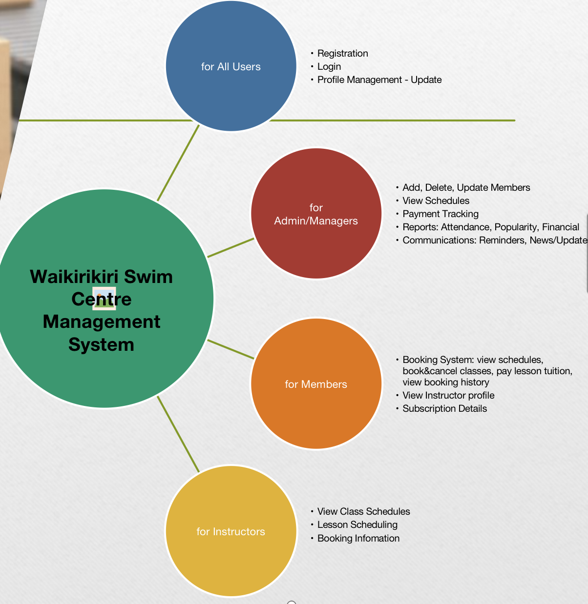

# Semester One 2023 | COMP639 Studio Project | Group Project 1
---------------------------------------
#### Marks:
---------------------------------------
## Functions:

## Individual Workload:
### Sprint 1
1. Created the database and tables with data / 1hour
2. Set up template folder and static folder, created 4 base templates for public view and 3 roles, each template can catch flash messages, make each template linked with custom css, js, and bootstrap / 2hours
3. Created and design the logo and home page / 1hour 
4. Login and Logout function /2hours

### Sprint 2
1. Members book group classes function / 4hours
2. Members book individual lessons function /4hours
3. Help members to revise all display of schedules  - to create dynamic tables so that new data can be shown in the table /5hours
4. Logout function /1hour
5. Help member to debugging problems of uploading instructor image to designated routes, displaying the image in their profile correctly, and displaying them in member view instructor profile sections /3hours

### Sprint 3
1. Tidy up issues left from sprint 2 review meeting, such as unifying CSS style, adding back button to all pages, adding drop down menus for three dashboard pages, adding “fully booked” in scheduled class tables, and adding pool info in the schedule tables, adding red stars in forms, creating java script confirmation popup when clicking pay and booking buttons
2. As a member, I want to view all my bookings for classes and swimming lessons, so that I know which class or lesson is upcoming
3. As a member, I want to pay for the individual swimming lesson, so that I can secure the instructor's timetable.
4. As a member, I want to cancel a booking
5. Create Pools table, and insert data into related tables
6. Helping team members to fix bugs
